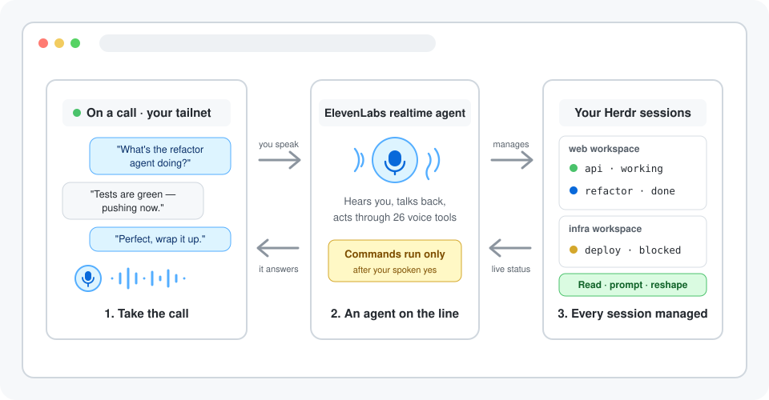

<p align="center"></p>

<h3 align="center">Stay on top of your coding agents without being glued to the desk or squinting at a terminal on your phone</h3>

<p align="center">Herdr Call lets you check on and steer your <a href="https://herdr.dev">Herdr</a> coding agents when your agents are waiting on an answer while you're away from the keyboard, by putting you on a live private call with a voice agent that can manage and steer all your Herdr sessions and get a waiting agent moving again with one spoken instruction.</p>

<p align="center"></p>

<p align="center"><a href="https://github.com/eliasstravik/herdr-call/blob/main/docs/getting-started.md"></a></p>

<p align="center"><sub>✓&nbsp;100%&nbsp;free&nbsp;and&nbsp;open&nbsp;source &nbsp; ✓&nbsp;Tailnet&#8209;only,&nbsp;never&nbsp;public &nbsp; ✓&nbsp;Built&nbsp;for&nbsp;Herdr&nbsp;coding&nbsp;agents</sub></p>

<p align="center"><small>⭐ Used by top developers</small></p>

<br />

## Keep the work moving while you're away from the keyboard

An agent that finishes, stalls, or hits a question gets your answer from the next room or the walk outside. You come back to progress you already approved instead of a wall of terminal output to catch up on.

## Choose between walking back, screen-sharing your desktop, watching notifications — or talking to your session

| | **Herdr Call** | Walking back | Remote desktop | Custom scripts |
|---|:---:|:---:|:---:|:---:|
| **Free software** | ✅ | ✅ | ✅ | ✅ |
| **Hands-free** | ✅ | ❌ | ❌ | ❌ |
| **Works from any tailnet device** | ✅ | ❌ | ✅ | ❌ |
| **Live agent status by voice** | ✅ | ❌ | ❌ | ❌ |
| **Sends instructions to agents** | ✅ | ✅ | ✅ | ❌ |
| **Reshapes tabs and panes** | ✅ | ✅ | ✅ | ❌ |
| **Spoken confirmation for commands** | ✅ | ❌ | ❌ | ❌ |
| **Never leaves your tailnet** | ✅ | ✅ | ❌ | ✅ |
| **No screen required** | ✅ | ❌ | ❌ | ✅ |

Keep your hands and eyes free. Herdr Call carries the conversation, your Herdr session does the work, and nothing crosses the public internet.

## Ask what your agents are doing. Steer them with your phone in your pocket.

### 📈 Hear the whole session at a glance

Every workspace, tab, pane, and agent is listed with its live state. Ask about one agent and get a spoken summary of what it just did, not a raw terminal dump.

### ⚡ Unblock an agent the moment it stalls

Send an instruction by voice, have the call wait until the agent is idle, blocked, or done, and get a notification when it is. The queue keeps moving while you make coffee.

### 💬 Run commands with a spoken yes

Anything that touches a terminal directly — commands, keystrokes, closing panes — is read back to you word for word first. Confirmations are single-use and expire in 60 seconds.

## Set up your first call in three steps

<table>
<tr>
<td align="center" valign="top" width="33%"><h3>1️⃣</h3><b>Install and start</b><br /><sub>Run <code>herdr plugin install eliasstravik/herdr-call &amp;&amp; herdr plugin action invoke start --plugin herdr-call</code>. The plugin builds itself and opens its tab.</sub></td>
<td align="center" valign="top" width="33%"><h3>2️⃣</h3><b>Paste your ElevenLabs key</b><br /><sub>Paste your key when the Herdr Call tab asks — first run only. Everything else configures itself.</sub></td>
<td align="center" valign="top" width="33%"><h3>3️⃣</h3><b>Call your agent</b><br /><sub>The pane prints your private call URL and a QR code. Scan it with your phone and start talking to your session.</sub></td>
</tr>
</table>

## Get everything included, free

<table align="center">
<tr>
<td align="center" valign="top"><sub>For developers who run coding agents in Herdr</sub><br /><h2>Free</h2><div align="left">&nbsp;&nbsp;&nbsp;✓&nbsp; 26 voice tools for status, steering, and layout<br />&nbsp;&nbsp;&nbsp;✓&nbsp; Auto-provisioned ElevenLabs agent and prompt<br />&nbsp;&nbsp;&nbsp;✓&nbsp; Spoken two-phase confirmation for guarded actions<br />&nbsp;&nbsp;&nbsp;✓&nbsp; Loopback-only server with short-lived tokens<br />&nbsp;&nbsp;&nbsp;✓&nbsp; Locked to your own tailnet login by default<br />&nbsp;&nbsp;&nbsp;✓&nbsp; Community support on GitHub</div></td>
</tr>
<tr>
<td align="center"><a href="https://github.com/eliasstravik/herdr-call/blob/main/docs/getting-started.md"></a></td>
</tr>
</table>

## Get your questions answered

### Do I need to know how to code?

No. The plugin builds itself on install, and the only thing you ever type is your ElevenLabs API key, once, when the call pane asks for it. Your tailnet hostname, the HTTPS mapping, and the voice agent all configure themselves.

### How do I return to the Herdr Call tab?

Leave the tab running and it will survive normal Herdr detach and reattach. If you close it, or want
to focus it again, run:

```bash
herdr plugin action invoke start --plugin herdr-call
```

The command focuses the existing tab or opens a new one. The
[getting-started guide](docs/getting-started.md#return-to-herdr-call) also includes an optional
`Ctrl+B`, `Shift+C` shortcut.

### What permissions does the ElevenLabs key need?

Only the **ElevenAgents** write permission — create a key with just that scope and leave everything else off. The plugin uses it to provision and update its voice agent and to mint short-lived call tokens.

### Is the call reachable from the internet?

No. The server binds to loopback only, and you reach it through Tailscale Serve — TLS and a verified tailnet identity in front of `127.0.0.1`, never Funnel. By default only your own tailnet login may drive the call; add teammates with `allowed_tailnet_users`, or set `auto_serve = false` to keep the call local-only. [`SECURITY.md`](SECURITY.md) covers the full model.

### Can the voice agent run commands on my machine?

Only after you say yes. Direct terminal actions are prepared first, read back to you word for word, and executed only on spoken confirmation. Each confirmation is single-use and expires in 60 seconds.

### Where does my ElevenLabs API key live?

The pane saves it to `config.toml` inside the plugin's config directory, server-side, readable only by your user. The browser only ever receives a short-lived conversation token, never the key.

### Do I have to configure anything in the ElevenLabs dashboard?

No. The agent's prompt, model, and all 26 client tools are created and kept up to date from [`src/agent/prompt.md`](src/agent/prompt.md) and [`src/shared/tools.ts`](src/shared/tools.ts).

### What about prompt injection from terminal output?

Terminal and agent output is wrapped in untrusted-content markers the voice model is instructed to treat as inert, and every risky action still needs your spoken yes. [`SECURITY.md`](SECURITY.md) describes the residual risk honestly.

### What does it cost?

Herdr Call is free and MIT licensed. You pay ElevenLabs for the voice minutes and models you use, and Tailscale's personal plan covers the tailnet.

## Take your first call in five minutes

<p align="center">Your session is one install and one pasted key away from answering the phone. Herdr Call relays the words. Your agents do the work.</p>

<p align="center"><a href="https://github.com/eliasstravik/herdr-call/blob/main/docs/getting-started.md"></a></p>

<p align="center"><sub>✓&nbsp;100%&nbsp;free&nbsp;and&nbsp;open&nbsp;source &nbsp; ✓&nbsp;Tailnet&#8209;only,&nbsp;never&nbsp;public &nbsp; ✓&nbsp;Built&nbsp;for&nbsp;Herdr&nbsp;coding&nbsp;agents</sub></p>

<p align="center"><small>⭐ Used by top developers</small></p>
